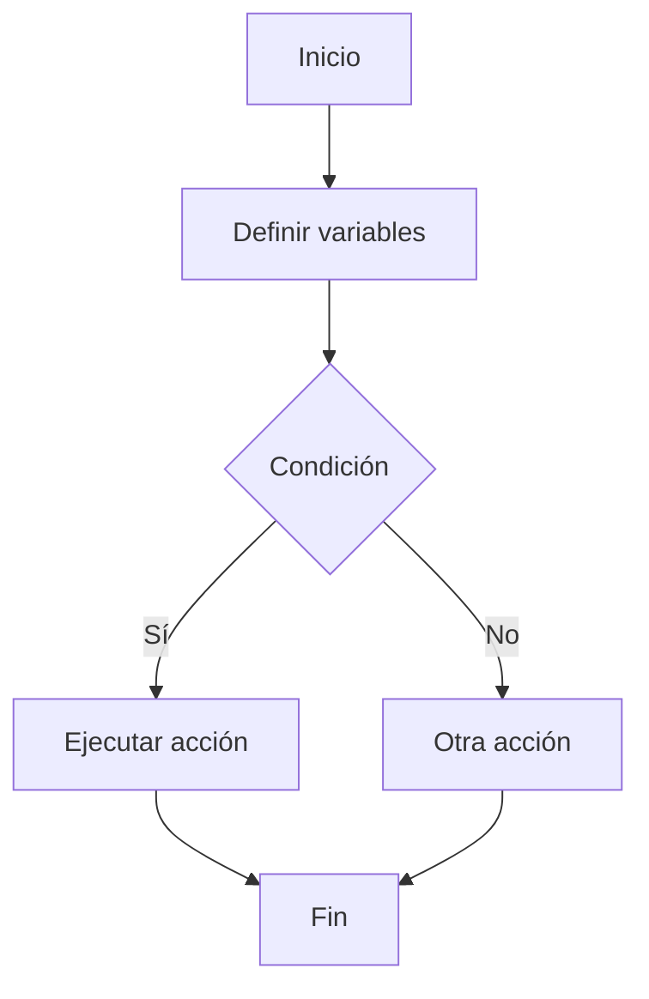
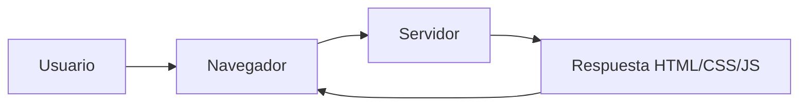
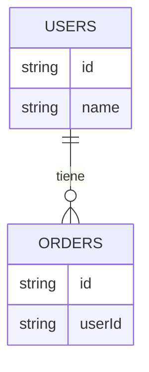
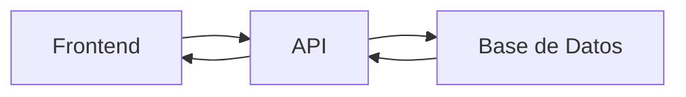
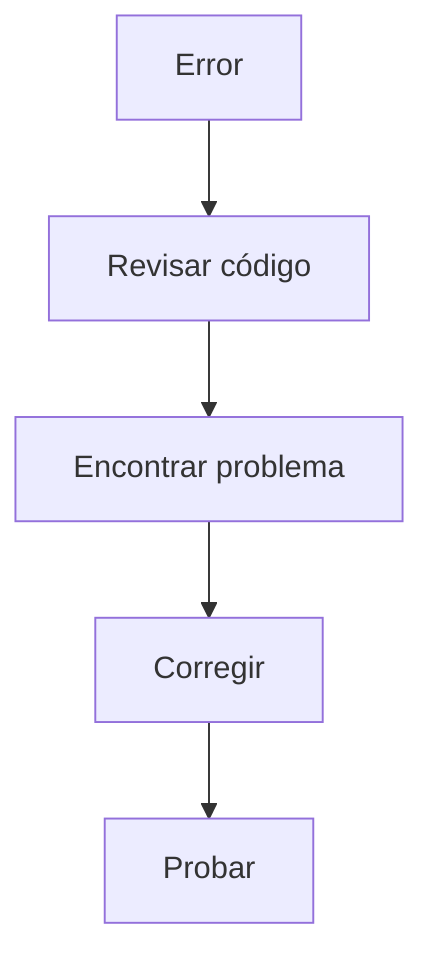
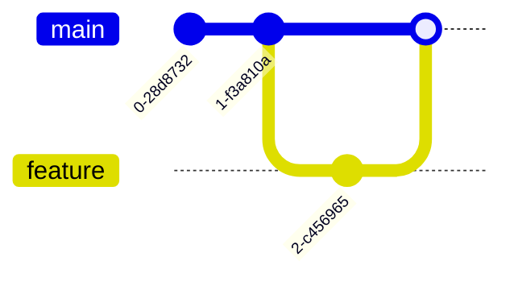
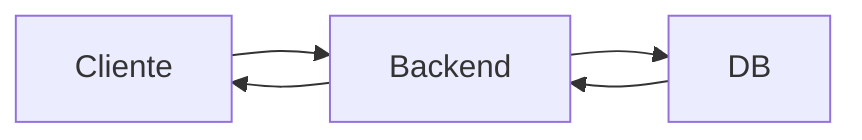
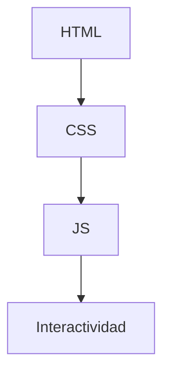
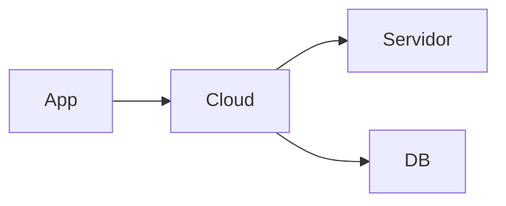
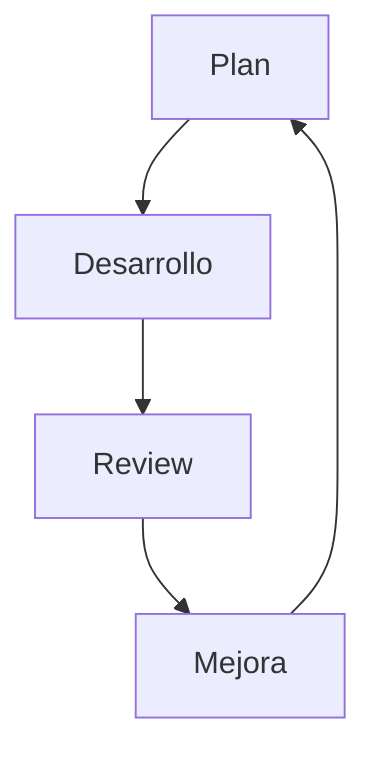

# 📘 Fullstack Learning Guide – Plan de Estructura

## 🧭 Objetivo
Crear una guía clara, rápida y práctica para acompañar el aprendizaje de desarrollo fullstack, basada en la malla académica, evitando confusión y sobrecarga.

Esta guía NO reemplaza los estudios, sino que sirve como:
- mapa mental
- referencia rápida
- apoyo para entender conceptos clave

---

## 🧠 Enfoque de la guía

Cada tema seguirá esta estructura:

1. **Explicación simple**
   - Definición clara y fácil de entender

2. **¿Para qué sirve?**
   - Contexto práctico

3. **Conceptos clave**
   - Puntos importantes que debe reconocer

4. **Esquema visual (Mermaid)**
   - Representación rápida para entender el flujo

5. **Recursos**
   - Gratis (rápidos y directos)
   - Platzi (puntuales, no cursos largos)

---

## 🧱 Estructura general

La guía se divide en 2 periodos:

### 🟦 Primer Periodo Académico
- Fundamentos de Programación
- Introducción al Desarrollo Web
- Fundamentos de Base de Datos
- Principios de Diseño y Arquitectura de Software
- Pruebas y Depuración de Software
- Control de Versiones y Seguridad

### 🟩 Segundo Periodo Académico
- Desarrollo Back-End
- Desarrollo Front-End
- Tecnologías Cloud y DevOps
- Metodologías Ágiles
- Titulación

---

## 🗂️ Estructura del proyecto (Markdown)

```
/periodo-1/
  fundamentos-programacion.md
  introduccion-web.md
  base-de-datos.md
  arquitectura-software.md
  debugging.md
  git-seguridad.md

/periodo-2/
  backend.md
  frontend.md
  cloud-devops.md
  metodologias-agiles.md
  titulacion.md
```

---

## ⚙️ Estrategia de uso

- No intentar aprender todo de una vez
- Usar la guía como apoyo mientras estudia
- Si algo no se entiende → revisar recursos
- Priorizar comprensión sobre velocidad

---

## 🚀 Roadmap de construcción

### Fase 1 (actual)
- Definir estructura base
- Crear README con plan general

### Fase 2
- Crear contenido del **Primer Periodo**
- Priorizar:
  - Fundamentos de Programación
  - Web
  - Base de Datos

### Fase 3
- Completar resto del Primer Periodo
- Refinar explicaciones

### Fase 4
- Crear contenido del Segundo Periodo

### Fase 5 (opcional)
- Convertir a documentación con Astro
- Agregar navegación tipo docs
- Mejorar UX

---

## 💡 Posibles mejoras futuras

- Añadir ejercicios por tema
- Añadir ejemplos prácticos
- Convertir en sitio web
- Compartir como recurso educativo

---

## 🧠 Nota importante

Esta guía debe ser:
- clara
- directa
- sin exceso de teoría

El objetivo es:
👉 **evitar que la persona se pierda mientras aprende**

---

## 👉 Siguiente paso

Crear el primer archivo:

```
/periodo-1/fundamentos-programacion.md
```

y comenzar con el contenido siguiendo la estructura definida.
y
# --- NUEVO CONTENIDO ---

---

# 📚 GUÍA COMPLETA (BORRADOR INICIAL)

## 🧭 Cómo usar esta guía
- **Primero**: lee la explicación simple  
- **Segundo**: revisa el esquema (Mermaid)  
- **Tercero**: revisa los conceptos clave  
- **Cuarto**: usa los recursos si algo no queda claro  

---

# 🟦 PRIMER PERIODO ACADÉMICO

---

# 🧩 FUNDAMENTOS DE PROGRAMACIÓN

## 🧠 ¿Qué es programar?
Programar es darle instrucciones a una computadora para que haga algo paso a paso.

## 🔑 Conceptos clave
- Variables
- Tipos de datos
- Condicionales
- Bucles
- Funciones

## 📊 Esquema


## 📚 Recursos
- Gratis: https://www.freecodecamp.org/learn/
- Platzi: Curso de Fundamentos de Programación (buscar sección de lógica)

---

# 🌐 INTRODUCCIÓN AL DESARROLLO WEB

## 🧠 ¿Cómo funciona una web?
Una web funciona con cliente (navegador) y servidor.

## 📊 Esquema


## 🔑 Conceptos clave
- HTML → estructura
- CSS → estilos
- JS → lógica

## 📚 Recursos
- Gratis: https://developer.mozilla.org/es/docs/Learn
- Platzi: Curso de Frontend Developer (solo HTML/CSS intro)

---

# 🗄️ FUNDAMENTOS DE BASE DE DATOS

## 🧠 ¿Qué es una base de datos?
Es un lugar donde guardas información organizada.

## 📊 Esquema


## 🔑 Conceptos clave
- Tablas
- Filas
- Relaciones
- SQL básico

## 📚 Recursos
- Gratis: https://sqlbolt.com/
- Platzi: Curso básico de SQL

---

# 🏗️ PRINCIPIOS DE DISEÑO Y ARQUITECTURA

## 🧠 ¿Qué es una API?
Una API es un intermediario que permite que dos sistemas se comuniquen.

👉 Ejemplo: tu app pide datos → API → base de datos → respuesta

## 📊 Esquema


## 🔑 Conceptos clave
- API
- Cliente / Servidor
- Arquitectura en capas

## 📚 Recursos
- Gratis: https://restfulapi.net/
- Platzi: Curso de APIs REST (solo conceptos iniciales)

---

# 🐞 PRUEBAS Y DEPURACIÓN

## 🧠 ¿Qué es debugging?
Es encontrar y corregir errores en el código.

## 📊 Esquema


## 🔑 Conceptos clave
- Errores
- Logs
- Testing básico

## 📚 Recursos
- Gratis: https://developer.chrome.com/docs/devtools/
- Platzi: Curso de Debugging

---

# 🔧 CONTROL DE VERSIONES Y SEGURIDAD

## 🧠 ¿Qué es Git?
Es una herramienta para guardar versiones del código.

## 📊 Esquema


## 🔑 Conceptos clave
- commit
- branch
- merge

## 📚 Recursos
- Gratis: https://learngitbranching.js.org/
- Platzi: Curso de Git y GitHub

---

# 🟩 SEGUNDO PERIODO ACADÉMICO

---

# ⚙️ DESARROLLO BACK-END

## 🧠 ¿Qué hace el backend?
Se encarga de la lógica, base de datos y APIs.

## 📊 Esquema


## 🔑 Conceptos clave
- APIs
- autenticación
- lógica de negocio

## 📚 Recursos
- Gratis: https://nodejs.dev/learn
- Platzi: Curso de Backend con Node

---

# 🎨 DESARROLLO FRONT-END

## 🧠 ¿Qué hace el frontend?
Es lo que el usuario ve y usa.

## 📊 Esquema


## 🔑 Conceptos clave
- DOM
- eventos
- frameworks

## 📚 Recursos
- Gratis: https://javascript.info/
- Platzi: Curso de React (conceptos básicos)

---

# ☁️ CLOUD Y DEVOPS

## 🧠 ¿Qué es cloud?
Usar servidores en internet en lugar de tu computadora.

## 📊 Esquema


## 🔑 Conceptos clave
- deploy
- hosting
- CI/CD

## 📚 Recursos
- Gratis: https://aws.amazon.com/what-is-cloud-computing/
- Platzi: Curso de Deploy

---

# 🔄 METODOLOGÍAS ÁGILES

## 🧠 ¿Qué es Scrum?
Forma de trabajar en equipo en ciclos cortos.

## 📊 Esquema


## 🔑 Conceptos clave
- sprint
- backlog
- daily

## 📚 Recursos
- Gratis: https://scrumguides.org/
- Platzi: Curso de Scrum

---

# 🎓 TITULACIÓN

## 🧠 ¿Qué es?
Aplicar todo lo aprendido en un proyecto real.

## 🔑 Enfoque
- frontend + backend
- base de datos
- deploy

---

# 🚀 NOTA FINAL

Esta guía no es para aprender TODO, es para:
👉 **no perderse mientras aprende**

Si algo no queda claro:
- no avanzar sin entender lo básico
- usar los recursos puntuales

---

## 💡 Si quieres mejorar esto luego
Puedo ayudarte a:
- convertirlo en app con Astro tipo docs 🔥
- agregar ejercicios por tema
- adaptarlo a su ritmo real de estudio