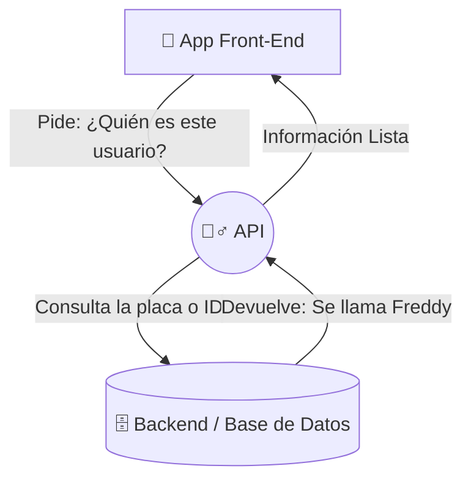

## 🎯 Concepto Rápido
**Diseñar la Arquitectura es como crear los planos y la circulación interna de un Aeropuerto.**
Si el sistema de equipaje no puede conectarse fluídamente con los aviones o el registro de vuelos, el caos es total. Todo sistema de TI requiere interconectar piezas sin ahogarse ni romperse al mínimo cambio. Y el conector por excelencia es la *"API"*.

## 💡 Analogía Práctica (El Mesero y la API)
**¿Por qué tanto furor con la palabra API?**
Imagínate que entras a tu restaurante preferido. Tú eres el **Frontend o Cliente Web**. En el equipo de cocina están los mejores procesos guardando los productos (**El Backend y la BD**).
- Tú como cliente nunca entras y sacas la carne de la nevera.
- Necesitas enviar una comanda. Ahí entra en juego el **Mesero** (la API).
- Tú le das la petición al API: *"Tráeme la factura y los pedidos anteriores"* (Método GET de tu celular al mesero).
- Él va a la cocina, le cocinan la respuesta lógica, él la toma y te la sirve en tu pantalla en milisegundos.

:::tip[Ojo Analítico / Comercial]
El negocio del software hoy es conectar APIs de otros. Las apps no nacen programando su mapa 3D desde cero ni su procesador de cobros bancarios desde cero. Piden los mapas mediante *"la API de Google"* y procesan los pagos contratando *"la API de Stripe"*. Así delegarás cosas pesadas.
:::

## 🗺️ Mapa Visual (Flujo Frontend-API-Backend)

## 📚 Recursos para Profundizar

### 🆓 Material Gratuito Corto
- **Video Excelente:** [¿Qué es una API?](https://www.youtube.com/watch?v=u2Ms34GE14U) - Video usando la famosa analogía del restaurante para que el concepto de API haga *click* en 2 minutos.
- **Formato y Mensajería:** Aprender súper rápido qué significa JSON (son esas llavecitas `{ "Nombre": "Freddy" }` que verás toda tu carrera, es el archivo/idioma en que viajan los datos).

### 💚 Material en Platzi (Al grano)
- **Clase Vital (Dentro del Curso de API REST):** Entiende obligatoriamente la clase de **Tipos de Petición HTTP** para poder pedir los datos al servidor.
  - `GET`: Para traer y consultar.
  - `POST`: Para registrar y enviar.
  - `PUT`: Para actualizar partes.
  - `DELETE`: Para eliminar un dato.
