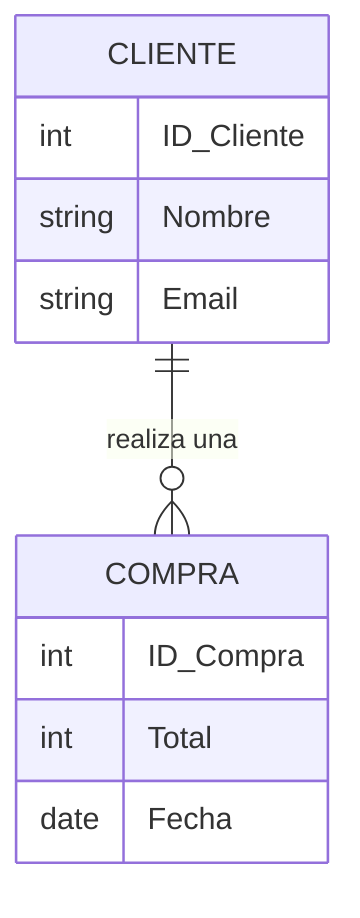

## 🎯 Concepto Rápido
**Una base de datos (BD) es un Excel "hipervitaminado" y seguro, diseñado para aguantar tráfico extremo.**
Si abres miles de transacciones de venta simultáneas en un archivo de Excel, todo tu negocio se congela y colapsa. Las BD existen para poder manejar, relacionar y extraer datos a velocidades impresionantes.

## 💡 Analogía Práctica
Supongamos que analizas los datos de un E-commerce:
- **Tabla Analítica de Usuarios:** Tienes filas y columnas con información (Nom, Teléfono).
- **Tabla de Pedidos:** Indica qué usuario compró qué producto.

Existen principalmente dos mundos en las bases de datos:
1. **Relacionales (SQL):** Como un Excel perfecto. Ideales para datos súper estructurados (ej. facturación, inventarios comerciales). Todo encaja en tablas.
2. **No Relacionales (NoSQL):** Como un archivador libre sin reglas rígidas. Ideales para el caos organizado, datos masivos y elementos interactivos (ej. catálogo de streaming o redes sociales). Guarda objetos sueltos.

Al inicio usarás **Bases de Datos Relacionales (SQL)**. Lo más valioso de este mundo son las relaciones generadas gracias a las placas o **Identificadores (IDs)** de las cosas.

:::note[La regla de oro del ID]
Cada fila agregada a una tabla tiene un **ID único** (Primary Key). Es igual que la placa vehicular; pueden existir dos carros azules de la misma marca, pero los diferencia su placa. Las bases de datos "amarran" la información usando esas placas.
:::

## 🗺️ Mapa Visual (Relaciones)

## 📚 Recursos para Profundizar

### 🆓 Material Gratuito Corto
- **Video Diferencia Clave:** Diferencias entre bases de datos **SQL (Tablas y columnas) vs NoSQL (Documentos parecidos a los contratos)**.
- **Herramienta/Práctica:** [Curso de SQL Interactivo (JSCamp)](https://www.jscamp.dev/sql) - No instales nada. Usa este espectacular curso interactivo para entender el "idioma" SQL elaborando comandos como `SELECT` o `WHERE` directo en tu navegador.

### 💚 Material en Platzi (Al grano)
- **Curso:** [Curso de Fundamentos de Bases de Datos](https://platzi.com/cursos/bd/).
- **Estrategia Rápida:** La **"sección de Entidad-Relación"** vale su peso en oro. Dominar cómo "dibujar" y pensar una tabla y sus conexiones te ahorra más horas de programación de las que te imaginas.
