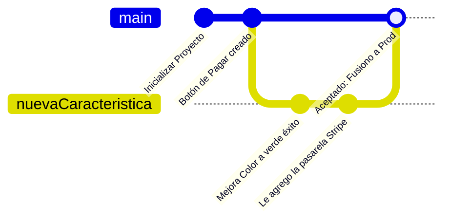

## 🎯 Concepto Rápido
**Git es la máquina del tiempo donde guardas la historia de origen, nudo y desenlace del código de tu compañía. GitHub es el "Instagram/Nube" donde el equipo puede ver e interactuar con ese código.**
Se acabó la edad oscura de crear copias locas en tu computadora llamándolas: `analisis_final`, `analisis_final_FINAL_ahora_SI`, `analisis_FINAL_V1_LITERAL`.

## 💡 Analogía Práctica
Imagina que están entre tres compañeras armando el Libro Contable Anual.
- **Commit:** Es literalmente tomar una "Foto del Estado Actual" del proyecto, y adjuntarle una etiqueta: *"Cargué las gráficas del trimestre Q2"*.
- **Branch (Rama de experimento):** Tomas el avance y creas un mundo paralelo con una copia propia, porque quieres experimentar sin causar temor a que tu compañera llore porque tocaste el Archivo Maestro (El `Main`).
- **Merge o Pull Request:** Muestras tu progreso a tus jefes en base al experimento de rama que hiciste, pasa los testeos, es aceptado, e integran (Fusionan) tus cambios a la línea oficial global.

:::danger[¡Tu primer regla de seguridad vitalícia!]
**Jamás subas una clave, pin, ID bancario, o API_Key de pagos (tokens) visible a un repositorio virtual u o público de GitHub.** Existen bots mundiales de hackers escaneando bases y al captar tu Token, te usarán millones de dólares a la cuenta personal conectada si descuidas este pequeño e insignificante detalle por accidente.
:::

## 🗺️ Mapa Visual

## 📚 Recursos para Profundizar

### 🆓 Material Gratuito Corto
- **Video Principal:** [Aprende GIT ahora! curso completo GRATIS por HolaMundo](https://www.youtube.com/watch?v=VdGzPZ31ts8&t=502s&ab_channel=HolaMundo) (Muy claro y visual).
- **Juego Interactivo (Prueba de 15 días):** [Learn Git Branching](https://learngitbranching.js.org/?locale=es_ES). Es una maravilla para visuales; aprendes Git jugando moviendo el Diagrama de ramas con comandos.

### 💚 Material en Platzi (Al grano)
- **Curso:** [Curso Profesional de Git y GitHub](https://platzi.com/cursos/git-github/).
- **Estrategia Rápida:** Lo vital es dominar un ciclo base de vida de un estudiante o ingeniero JR y no un ingeniero senior: Saber configurar su repo, cómo agregar las cosas `git add .`, cómo tomar la foto `git commit...` y empujar al repositorio remoto de forma segura con `git push`. Punto, eso será el 95% de sus problemas iniciales.
