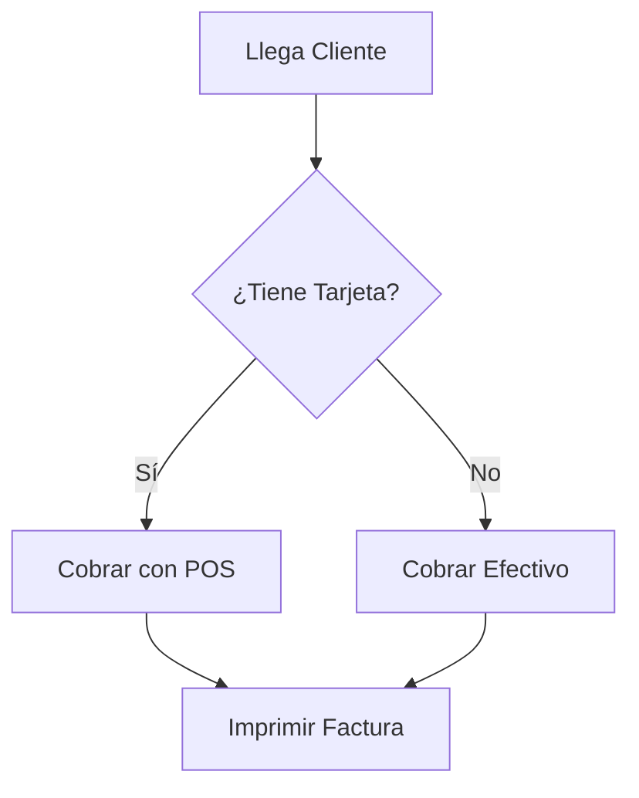

## 🎯 Concepto Rápido
**Programar es como crear un manual de procesos paso a paso para un empleado muy eficiente pero sin sentido común.**
La computadora hará exactamente lo que le digas, ni más ni menos. Si olvidas decirle "abre la puerta antes de salir", se estrellará contra la puerta.

## 💡 Analogía Práctica
Imagina que eres la gerente de una tienda y tienes que entrenar a un nuevo cajero.
- **Variables:** Son como "cajones" con etiquetas donde guardas la información ("Cajón 1: Dinero en efectivo").
- **Condicionales (If/Else):** Es la regla que le das al cajero: *"SI el cliente paga con billete falso, ENTONCES rechaza el pago, SINO acepta el dinero"*.
- **Bucles (Loops):** Es una tarea repetitiva: *"POR CADA cliente en la fila, escanea sus productos"*.
- **Funciones:** Es una tarea agrupada. En lugar de explicar paso a paso cómo hacer un cierre de caja todos los días a las 6pm, creas una sola regla e instrucción llamada `hacerCierreDeCaja()` y él ya sabe qué pasos ejecutar internamente.

## 🗺️ Mapa Visual (Flujo de Decisión)

## 📚 Recursos para Profundizar

### 🆓 Material Gratuito Corto
- **Lectura/Ejemplos:** [Aprende JavaScript - dev](https://www.aprendejavascript.dev/) (Ideal para ver cómo lucen los cimientos de la lógica).
- **Práctica Interactiva:** Ruta de Front-End en [freeCodeCamp.org](https://www.freecodecamp.org/espanol/learn/full-stack-developer/) (Perfecto para asimilar lógica progresivamente).

### 💚 Material en Platzi (Al grano)
- **Bases Informáticas:** [Curso Básico de Computadores e Informática](https://platzi.com/cursos/computacion-basica/).
- **Ruta Oficial:** [Ruta web de Fundamentos de Programación y Desarrollo Web](https://platzi.com/ruta/web-fundamentos/).
- **Estrategia:** Antes de programar tu app, pasa por estos para entender verdaderamente cómo piensa la computadora.
