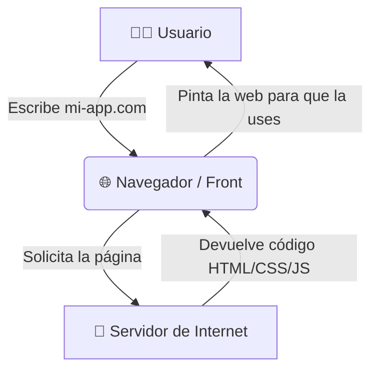

## 🎯 Concepto Rápido
**La web es como construir y decorar la fachada principal de una tienda para que los clientes interactúen.**
Para que la tienda funcione, no se caiga y se vea hermosa, necesitas tres materiales esenciales: HTML, CSS y JavaScript.

## 💡 Analogía Práctica
Piensa en el desarrollo web front-end como si estuvieras construyendo un local físico:
- **HTML (Estructura y Planos):** Son las vigas, paredes y cimientos. Te dice dónde va la puerta y dónde va el rótulo. Sin HTML no hay nada.
- **CSS (Estilo y Pintura):** Es el diseño de interiores, muebles y colores de marca. Es lo que hace que la tienda visualmente conecte y sea linda (colores, tamaños, diseño).
- **JavaScript (Lógica/Interactividad):** Son los sistemas eléctricos, la puerta automática que se abre cuando te acercas, la alarma. Hace que las cosas "respondan" a lo que hace el cliente.

### ¿Cliente vs Servidor?
- **El Cliente (Frontend):** Es el navegador (Chrome, Safari). Es la vitrina pública donde interactúa el comprador.
- **El Servidor (Backend):** Es la bodega gigante que hay en otra ciudad. El cliente de tu web nunca entra a esa bodega, los empleados se encargan de traer y llevar información (productos) directo a la vitrina cuando el cliente lo pide.

## 🗺️ Mapa Visual

## 📚 Recursos para Profundizar

### 🆓 Material Gratuito Corto
- **Video HTML:** [Curso COMPLETO de HTML GRATIS por midulive](https://www.youtube.com/watch?v=3nYLTiY5skU&ab_channel=midulive) (Vital para estructura, y SEO).
- **Video CSS:** [Curso de CSS desde cero completo y GRATIS](https://www.youtube.com/playlist?list=PLUofhDIg_38q7l8gV4IVCz_pjUeyD99_j) (Diseño espectacular sin dolores de cabeza).
- **Práctica Continua (HTML y CSS):** Práctica en [freeCodeCamp.org](https://www.freecodecamp.org/espanol/learn/full-stack-developer/).

### 💚 Material en Platzi (Al grano)
- **Curso:** [Curso de HTML y CSS [Empieza Gratis]](https://platzi.com/cursos/html-css/).
- **Estrategia Rápida:** Mira los primeros módulos (Anatomía de HTML y cómo vincular un archivo CSS) para entender las bases, el resto lo dominarás con la práctica en los proyectos de la universidad.
