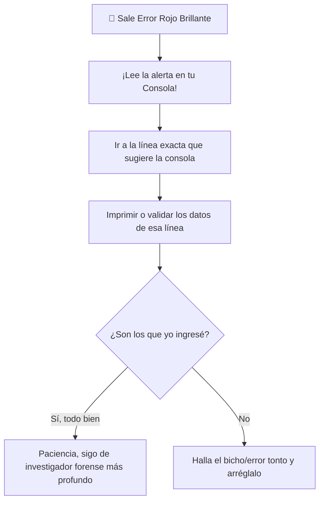

## 🎯 Concepto Rápido
**Depurar (Debugging) es convertirse en el investigador forense de tu sistema una vez que este "murió" o se bloqueó.**
Las aplicaciones *siempre* se van a quebrar por pequeños o grandes errores humanos ("Bugs"). Depurar es seguir el rastro sistemáticamente para hallar dónde escribiste una letra de más o pasaste un dato que no tocaba.

## 💡 Analogía Práctica (El tubo atascado)
Una app es como una tubería de agua de un kilómetro. De repente al barrio no le llega agua (se cayó la app y sale pantalla en blanco).
No hay lógica en levantar y dañar un kilómetro entero de calle de una vez para buscar el atasque. Eso sería agotador.
**¿Cómo hace Debug un programador?:**
1. Rompe un poco a la mitad (en el metro 500) y si hay agua, sabe que de ahí en adelante está bien. (Ahí es donde envías un `console.log("llegó al paso 2")` a ver si funciona).
2. Si sabe que entre el metro 500 y el 1000 cayó la tubería, vuelve a partir en el 750 para reducir más la zona de ataque.
3. Lo lograste: encuentras exactamente la línea que trunco la lógica.

:::note[Pruebas Automáticas (Testing)]
Probar en QA o Ingeniería significa contratar "Perritos robots virtuales" que envíen datos falsos y den clics automáticos a las 3 de la mañana contra tu sistema nuevo para que ellos detecten los bugs y no sean los clientes reales quienes los detecten a pleno luz del sol. A esto se le dice realizar pruebas unitarias y de integración.
:::

## 🗺️ Mapa Visual (Flujo mental cuando hay problemas)

## 📚 Recursos para Profundizar

### 🆓 Material Gratuito Corto
- **Inspección Rápida:** Aprieta la tecla `F12` en cualquier navegador web. Acostúmbrate a vivir en la parte llamada `Consola` (Console) ya que ahí estarán escritos los dolores y los gritos de ayuda del código de tu programa antes de colapsar. Acostúmbrate a leer esos errores en inglés.

### 💚 Material en Platzi (Al grano)
- **Curso:** [Curso Básico de Testing](https://platzi.com/cursos/testing/).
- **Estrategia Rápida:** Comprender la "Teoría del caos". Entiende 5 o 10 minutos de teoría de qué es un Unit Testing (aislar algo puntual y forzarlo) versus Integrations Testing (probar todas las piezas trabajando bajo carga).
