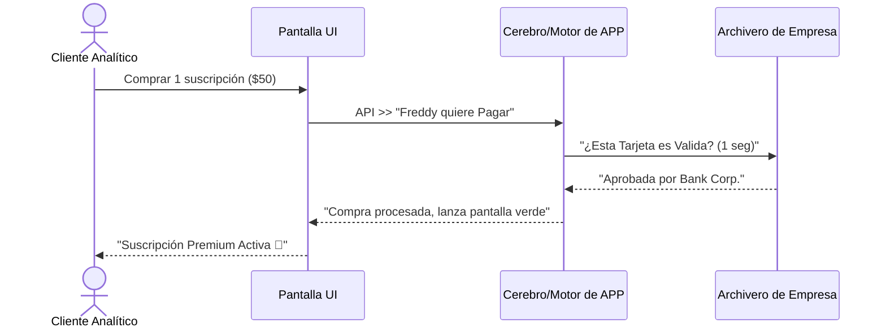

## 🎯 Concepto Rápido
**El Back-End son las bóvedas blindadas, la bodega y las reglas gerenciales que ocurren 'detrás de cortinas'.**
Es el cerebro de tu StartUp. El cliente jamás del mundo entra aquí ni lo toca, pero este motor es el único capaz de descontar saldos, permitir el acceso a documentos privados y calcular los porcentajes sin romperse.

## 💡 Analogía Práctica
Volvamos a la tienda comercial de tecnología Premium que ya conoces (Tu App Front-end):
- El **Back-End** es el cajero, el gerente de inventario y el jefe del perímetro.
- Cuando el cliente toca sobre *"Comprar"* en el celular (Front), el jefe de seguridad interna (Back) recibe ese papel de petición. Toma el papel y revisa *si el saldo cubre el pago y es lícito*, viaja a la bodega y verifica *si hay laptops reales* (Base de Datos). 
- Luego ejecuta la facturación lógica interna sin que tú intervengas.
- Si el Back-End está frágil, hackers de 17 años usarán la pantalla visual del front, te mandarán que el precio cueste $0.00 en la caja de texto y quebrarás al mediodía.

:::danger[Regla de Oro en Finanzas Tech]
Jamás, NUNCA confíes en los clics o calculos de la pantalla del celular (Front). Tus descuentos, cobros, y contraseñas deben estar fortificadas y refactorizadas en el código Back-End antes de autorizarse el acceso a la BD del servidor.
:::

## 🗺️ Mapa Visual (El corazón y cerebro en acción)

## 📚 Recursos para Profundizar

### 🆓 Material Gratuito Corto
- **Mentalidad Backend:** [Busca en YT "Qué es el Backend de HolaMundo"]. Es increíblemente conciso.
- **Vistas Generales de Especialidad:** Para saber con qué lenguajes "tocar" el motor, date una pasada por [Roadmap.sh Backend](https://roadmap.sh/backend). Solo la parte teórica.

### 💚 Material en Platzi (Al grano)
- **Curso:** [Curso de Backend con Node.js].
- **Estrategia Rápida:** No empieces haciendo aplicaciones. Observa atentamente las tres primeras lecciones sobre *Arquitectura Cliente/Servidor*. ¡Sin la teoría se ahogarán luego!
