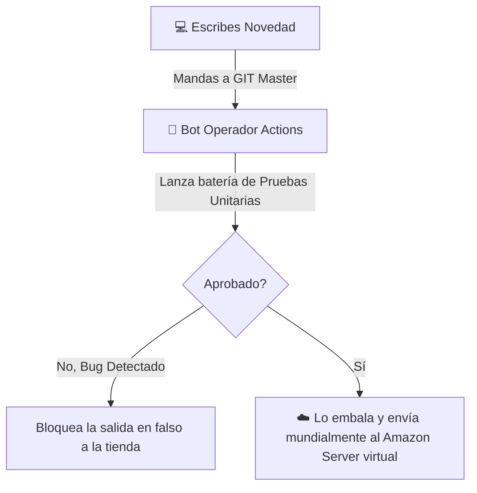

## 🎯 Concepto Rápido
**La Nube (Cloud) es simplemente el concepto alquilar una red de las gigantescas computadoras de otra compañía transnacional por unas horas en lugar de quemar dinero construyendo tus propios centros de datos.**
Si no lo llevas a la nube tu "aplicación full-stack universitaria" desaparece si apagas o reseteas tú portátil (localhost).

## 💡 Analogía Práctica (Emprendimiento de Alquiler de Máquinas)
1. **El mundo Cloud Computing:** 
Crear cuartos ultra asegurados, con cables submarinos y a temperatura gélida constante a la orilla del mar consume dólares. En su lugar ingresas a tu cuenta de **AWS (A. Web Services de Amazon)** o **Azure** de Microsoft y les haces clic en *"Réntame una mini pc por $2 usd esta madrugada"*. 
¿Tu app se hizo mega famosa tras anunciarla en un estadio? Aprietas otro botón que te enciende 20 copias simultáneas para abarcar toda la congestión por 3 horas, y lego las devuelves. Cero mantenimiento.

2. **La maquinaria de DevOps:**
Modificas un botón para regalar algo en el Back-end. ¿Cómo diablos transfieres esos archivos ultra pesados al PC en Londres de la Nube AWS a mitad de la noche para que se estrene en Japón globalmente?
Automatizando tubos. **Dev**elopment (programar) e **Op**erations (La operadora en la Nube AWS). DevOps usa robots (Acciones y Pipelines automáticos de GIT) que detectan tú clic. Solo por hacer tú un clíc el robot se despierta, carga los maletines automáticos y le instala la actualización silenciosa a el usuario final al instante con CERO riesgo de estrellarse manual. 

:::note[Vocabulario Comercial Estrella: CI/CD]
Escucharás "Pipeline de CI/CD". Eso es **Integración Continua y Despliegue Continuo**. Es la utopía corporativa en que un cambio hecho por un trabajador en el código llegue en 5 minutos en tiempo real hacia la red global mundial tras ser automatizado y probado a fondo para no crashear la central.
:::

## 🗺️ Mapa Visual (DevOps en 3 pasos logísticos)

## 📚 Recursos para Profundizar

### 🆓 Material Gratuito Corto
- **Video Imprescindible:** "DevOps Expilicado en Español Rápido", y un salto para visualizar a vista de mil pies lo gordo como **[Roadmap.sh (DevOps)](https://roadmap.sh/devops)**. Míralo y cuida no aprender todo a la vez.

### 💚 Material en Platzi (Al grano)
- **Estrategia Rápida:** No tienes que entrar de golpe a Amazon AWS Console que es para Sr's. Enfócate absolutamente a fondo en dominar cosas llamadas despliegues estáticos iniciales cómo el uso de **Vercel** o **Netlify**. Tu proyecto de titulación usará 100% de esta tecnología base de CD (Despliegue Continuo).
