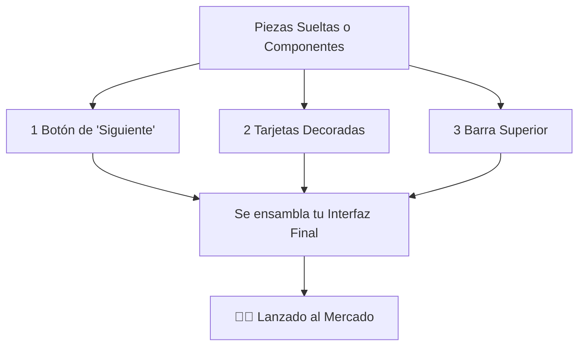

## 🎯 Concepto Rápido
**El Front-End es el "Showroom" o vitrina principal de tu negocio.**
Es todo lo que el usuario puede ver, tocar o clickear. Aquí es donde diseñas toda la fachada visual y la envuelves en funcionalidad para crear una experiencia ágil y responsiva (que fluya mágico desde el navegador de un celular moderno hasta la pantalla de una laptop).

## 💡 Analogía Práctica
Imagina que entras a la tienda oficial de un producto Premium:
- Las mesas brillantes, la paleta de colores y los dependientes impecables es el **Front-End**. Está diseñado psicológicamente para minimizar la fricción y guiarte a la compra o a la acción.
- En la U te enseñarán *React*, *Vue* o *Angular* (Dile "Frameworks" / Marcos de trabajo). Usarlos es como comprar bloques modulares de construcción. En lugar de crear un carrito de compras gigantesco desde ceros manualmente y cortando cada pedacito (Vanilla JS), tomas una librería como React que ya tiene el botón pre-ensamblado.

:::tip[El Santo Grial]
En el mundo comercial, un desarrollador Front-End no inventa el "Botón de Pagar" en cada pantalla. Ellos crean **"Componentes"** reutilizables (Como un bloque de Lego). Lo programan una sola vez de forma perfecta, y luego solo lo duplican como estampilla 50 veces a lo largo de tu app cambiándole el texto de adentró y ahorrándose 3 días de trabajo.
:::

## 🗺️ Mapa Visual (Flujo de un Diseño Modular)

## 📚 Recursos para Profundizar

### 🆓 Material Gratuito Corto
- **Práctica Interactiva:** Continúa rebotando la lógica Front-End en [freeCodeCamp.org](https://www.freecodecamp.org/espanol/learn/full-stack-developer/).
- **Video Vital:** Busca *"¿Qué es un Framework de Javascript?"*. La curva sube aquí, así que el concepto base debe reinar primero que el código.

### 💚 Material Certificado
- **Certificación Opcional:** [Meta Front-End Developer](https://www.coursera.org/professional-certificates/meta-front-end-developer) de Coursera (Es buenísima, pero no te satures de peso si la U te empuja muy pesado en carga horaria).
- **Enfoque Platzi:** Curso de React Básico o de frameworks orientados. Asegúrate de solo buscar *qué es el "DOM Virtual"* y qué es un componente sin sobre pensar.
