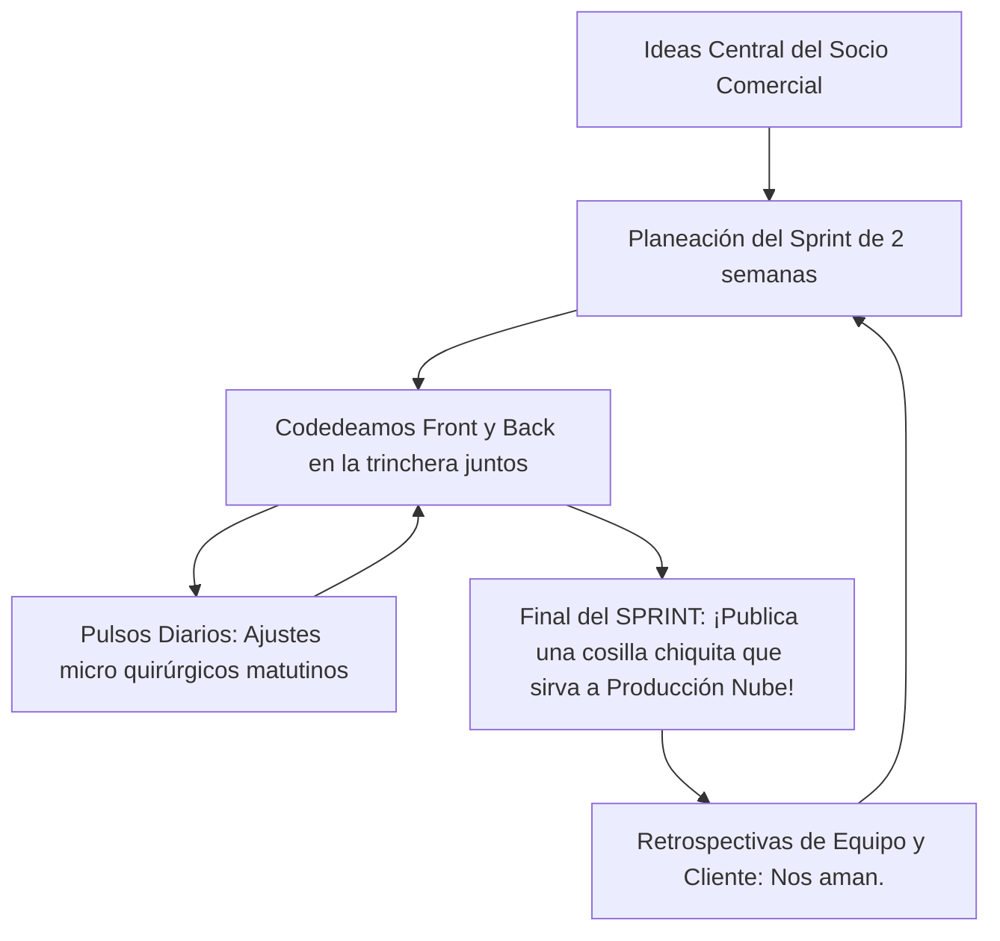

## 🎯 Concepto Rápido
**Las Metodologías Ágiles (sobre la cual reina "Scrum" / Marco de trabajo) son lineamientos ejecutivos que priorizan que tú StartUp/Equipo entreguen parte de funciones rentables en plazos relámpagos**, en lugar de enterrar años de planificación para entregar un barco perfecto que, cuando nace, el mercado o tu cliente odia por completo.

## 💡 Analogía Práctica Estructural
Eres la Lead Manager de App Tech. Construirás la App y el Front.
**💀 Tradicional o Cascada:** Pierden recursos analizando y planeando durante 3 meses por una lista exhaustiva de "todo absolutamente documentado". Programan aislados otros 5 meses. Se presentan a Titulación frente al cliente: *"No... odié cómo luce esto. Yo requería los filtros a la izquierda".*. Pérdida total de capital de trabajo y salud en vano por no charlar a tiempo y en dosis.

**✅ Scrum (La luz al túnel):** Toman la lista completa y dicen *"Chicos, parémonos en la caja número dos. Este "Sprint" (pequeño ciclo de corrida ágil de 14 días) nuestra única batalla será solo entregar la pantalla del "Log In" visual con CSS"*.
Puntos de toque de Scrum:
1. Las llamadas "Dailies": Todos de pie cada 24 hrs frente a una pizarra. Responden en 5 minutos: ¿Qué operé el lunes?, ¿A qué le apuntaré martes? y *"Chicos, Fredy de Bases de datos se atascó ayer en el Excel. ¿Ayuda vital?*.
2. Empujan lo vital, van publicando el producto roto en pañales y reciben métricas directas para corregir sus propias balas el Lunes del próximo ciclo veloz (Sprint 2).

:::tip[El Tablero Kanban Base (Post-Its mágicos)]
La reina base para organizarte y visualizar el cuello de botella es usar *Trello*, *Jira* o vistas de tarjetas de proyectos en *Notion*. 3 Columnas simples en vertical: **"Por Hacer" (Backlog)**, **"Las Manos En Acción o En Progreso"** y final feliz **"Publicado 📦"**.
:::

## 🗺️ Mapa Visual

## 📚 Recursos para Profundizar

### 🆓 Material Gratuito Corto
- **Bala Clara:** YouTube te llenará de opciones si lanzas "Aprender metodología SCRUM y la guía SCRUM oficial de PDF rápida". 

### 💚 Material en Platzi (Al grano)
- **Curso Vital:** Ojo a ti. Como un perfil orientado al Business / Management TI tú posees ventaja y **es tu absoluta rama**. Devora de ser posible entero el **[Curso de introducción a Scrum de Platzi]**. Dirige al programador usando sus propias armas ágiles.
