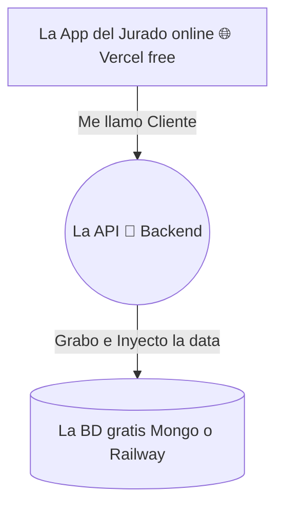

## 🎯 Concepto Rápido
**Titulación o tu proyecto cumbre se traduce obligatoriamente a pensar como Emprendedor en Construir el MVP = Tu 'Producto Mínimo Viable.**
El cáncer o suicidio del programador Fullstack universitario o aprendiz es intentar maquetar, lanzar y publicar el *"Siguiente Clon de Uber"* de la noche en solo unas 4 semanas antes del jurado.
Regla para graduarte o para una startup rentable: Tú misión principal final será demostrar que la aplicación resolvió UN caso minúsculo y simple de forma majestuosa de "lado-a-lado" (Front, conectó a la Nube seguro, la base guardó el Excel). Sin fallas. 

## 💡 Analogía Práctica Comercial (Caso de Ferrari)
Concepto sagrado de *YCombinator de MVP*:
Imagina ser retada a crear un artefacto de traslado terrestre interurbano y que valide si hay pago para ello por parte del jurado.
🚫 *Error Masivo:* Agendar crear llantas. Agendar planear asientos hiper lujosos... pasan los meses y te presentas con la "Lata del auto azul". Es decir: un backend roto y las ventanas del CSS bonitas, pero NO mueve personas.
✅ *Mentalidad MVP Tech:* Construir una Patineta que tenga llanticas plásticas hoy.
Semana 3 y tú patineta funciona y cruza de una cuadra al parque vecino con tu usuario de Backend loggeado y cobrado. ¡Aprobaste y lanzaste! Luego le engancharás más componentes lógicos (Filtros masivos, perfiles pesados de imagenes de AWS).

:::note[Lista Final Obligatoria - Proyecto Titulación Moderno]
Para sobrevivir al corte como Mínimo deberás cumplir la santísima trinidad limpia:
1. **Frontend Desplegado:** Tu vitrina en (Ejemplo Netlify o Vercel gratuito) donde yo logré teclear credenciales y ver mi Home simple pero adaptable.
2. **Back / Motor Asegurado:** Que mi `Password123` que tipearon en Frontend no llegue a AWS Nube de esa forma ridícola plana, debiste usar una función hash por en medio.
3. **Tu código Git:** Pulcro flujo visual, nada de subir tu clave por accidente y mostrando como subiste en Ramas semanales y publicaste y automatizaste para no quemar tiempos extras (DevOps).
:::

## 🗺️ Mapa Visual (Tu entrega MVP Final)

## 📚 Recursos para Profundizar

### 🆓 Material Gratuito Corto
- **Videos Mindset StartUp:** Entra y asimila documentales de "YCombinator The Minimum Viable Product de Michael Seibel" "El Sindrome de Parálisis por Análisis Programador" y mentalízate a NO construir funciones que el profesor y tú usuario todavía no pagarán y validarán. 
### 💚 Estrategia de Cierre
- En tú etapa Full, apaga los cursos extensivios. Dedícate a clonar estructuras visuales gratuitas, empuja ese Git en un par de días, y usa tú base construida hasta hoy solo apoyándote activamente en búsquedas en IA como "Como le conecto la clave Front al motor Backend" puntual bajo tu control de mando superior. ¡A triunfar!.
