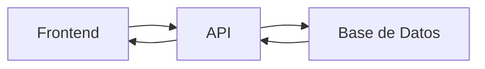

## 🧠 ¿Qué es una API?
Una API es un intermediario que permite que dos sistemas se comuniquen.

👉 Ejemplo: tu app pide datos → API → base de datos → respuesta

## 📊 Esquema

## 🔑 Conceptos clave
- API
- Cliente / Servidor
- Arquitectura en capas

## 📚 Recursos
- Gratis: [RESTfulAPI.net](https://restfulapi.net/)
- Platzi: Curso de APIs REST (solo conceptos iniciales)
