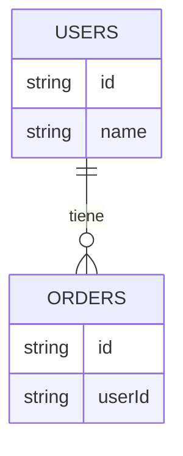

## 🧠 ¿Qué es una base de datos?
Es un lugar donde guardas información organizada.

## 📊 Esquema

## 🔑 Conceptos clave
- Tablas
- Filas
- Relaciones
- SQL básico

## 📚 Recursos
- Gratis: [SQLBolt - Aprende SQL interactivo](https://sqlbolt.com/)
- Platzi: Curso básico de SQL
