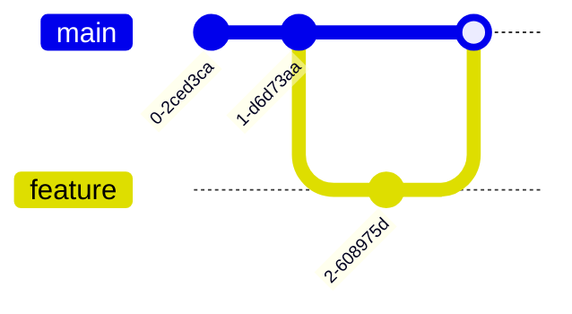

## 🧠 ¿Qué es Git?
Es una herramienta para guardar versiones del código y colaborar.

## 📊 Esquema

## 🔑 Conceptos clave
- commit
- branch
- merge

## 📚 Recursos
- Gratis: [Learn Git Branching](https://learngitbranching.js.org/)
- Platzi: Curso de Git y GitHub
