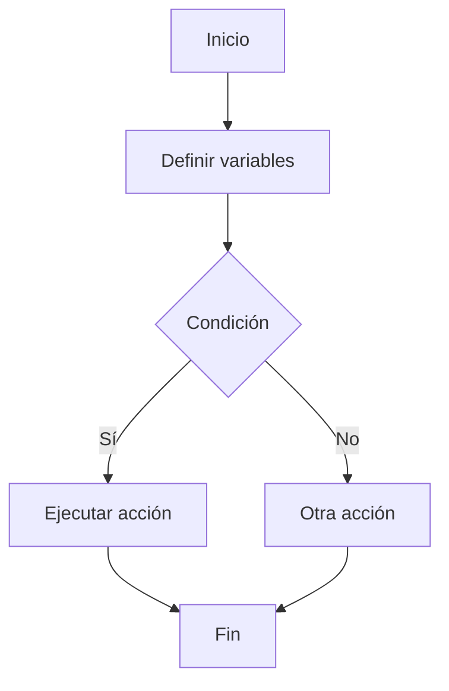

## 🧠 ¿Qué es programar?
Programar es darle instrucciones a una computadora para que haga algo paso a paso.

## 🔑 Conceptos clave
- Variables
- Tipos de datos
- Condicionales
- Bucles
- Funciones

## 📊 Esquema

## 📚 Recursos
- Gratis: [freeCodeCamp - Aprende a programar](https://www.freecodecamp.org/learn/)
- Platzi: Curso de Fundamentos de Programación (buscar sección de lógica)
