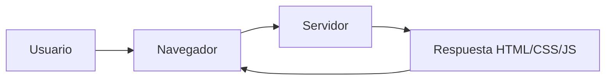

## 🧠 ¿Cómo funciona una web?
Una web funciona con cliente (navegador) y servidor.

## 📊 Esquema

## 🔑 Conceptos clave
- HTML → estructura
- CSS → estilos
- JS → lógica

## 📚 Recursos
- Gratis: [MDN Web Docs (Aprende desarrollo web)](https://developer.mozilla.org/es/docs/Learn)
- Platzi: Curso de Frontend Developer (solo HTML/CSS intro)
