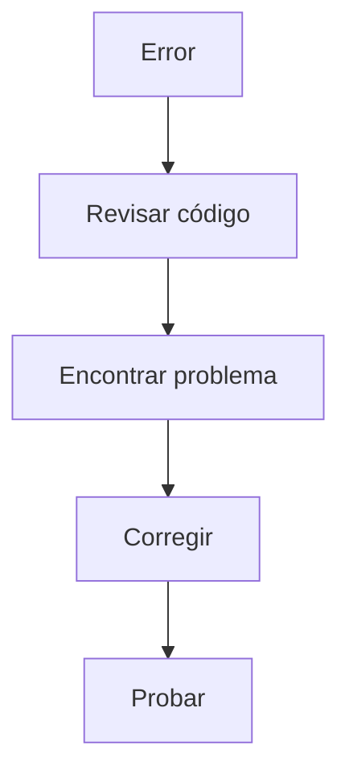

## 🧠 ¿Qué es debugging?
Es encontrar y corregir errores en el código.

## 📊 Esquema

## 🔑 Conceptos clave
- Errores
- Logs
- Testing básico

## 📚 Recursos
- Gratis: [Chrome DevTools](https://developer.chrome.com/docs/devtools/)
- Platzi: Curso de Debugging
