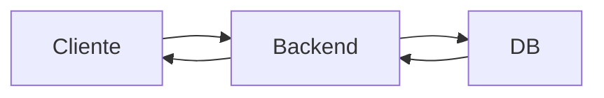

## 🧠 ¿Qué hace el backend?
Se encarga de la lógica de negocio, la base de datos y proveeduría de APIs (rutas y servicios).

## 📊 Esquema

## 🔑 Conceptos clave
- APIs y Endpoints
- Autenticación y Autorización
- Lógica de negocio

## 📚 Recursos
- Gratis: [Node.js Docs](https://nodejs.dev/learn)
- Platzi: Curso de Backend con Node.js
