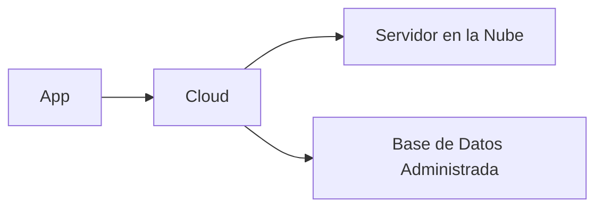

## 🧠 ¿Qué es cloud?
Se trata de utilizar poder de cómputo, almacenamiento y servicios (servidores en internet) provistos por empresas en lugar de usar un computador local.

## 📊 Esquema

## 🔑 Conceptos clave
- Deploy / Despliegue
- Hosting y Servidores
- CI/CD (Integración y Despliegue Continuo)

## 📚 Recursos
- Gratis: [Qué es Cloud Computing (AWS)](https://aws.amazon.com/what-is-cloud-computing/)
- Platzi: Curso de Deploy o AWS (básico)
