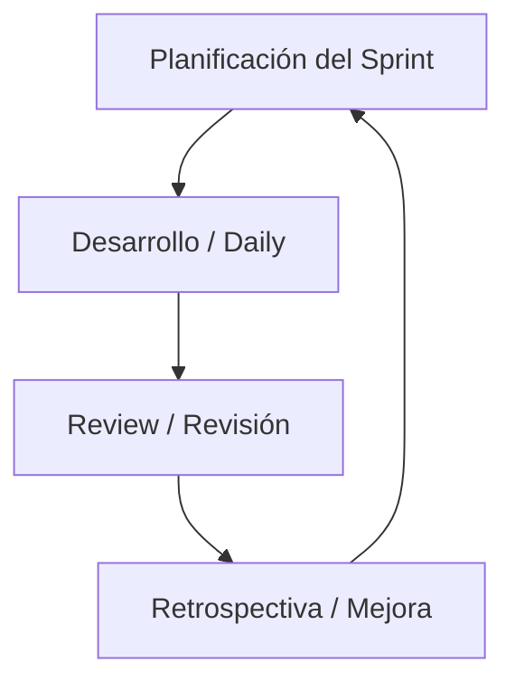

## 🧠 ¿Qué es Scrum?
Es un marco de trabajo ágil para colaborar y desarrollar software en equipos mediante iteraciones o ciclos cortos.

## 📊 Esquema

## 🔑 Conceptos clave
- Sprint y Sprint Planning
- Product/Sprint Backlog
- Daily Standup Meeting

## 📚 Recursos
- Gratis: [Guía Oficial de Scrum](https://scrumguides.org/)
- Platzi: Curso de Scrum
